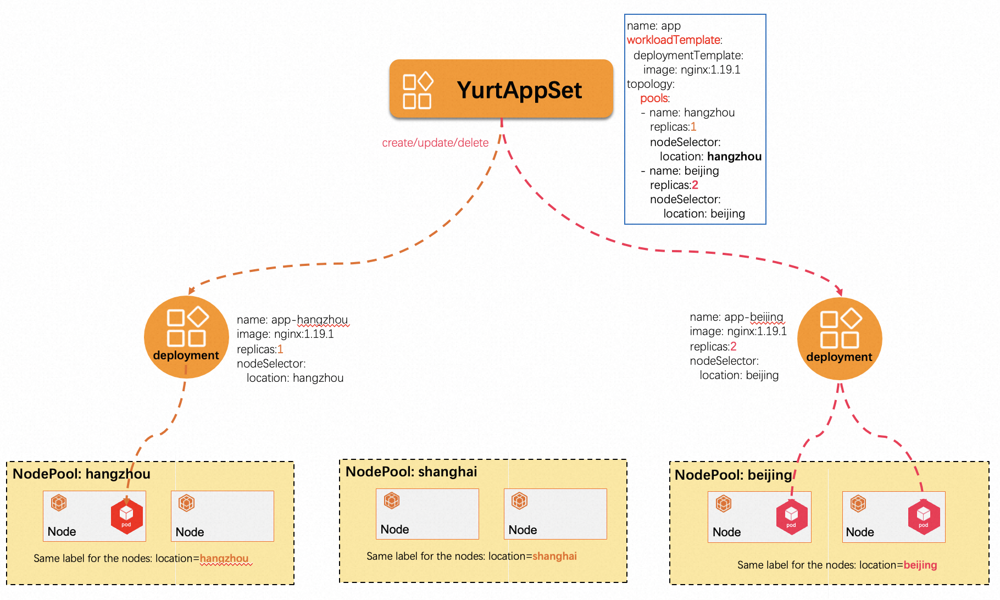
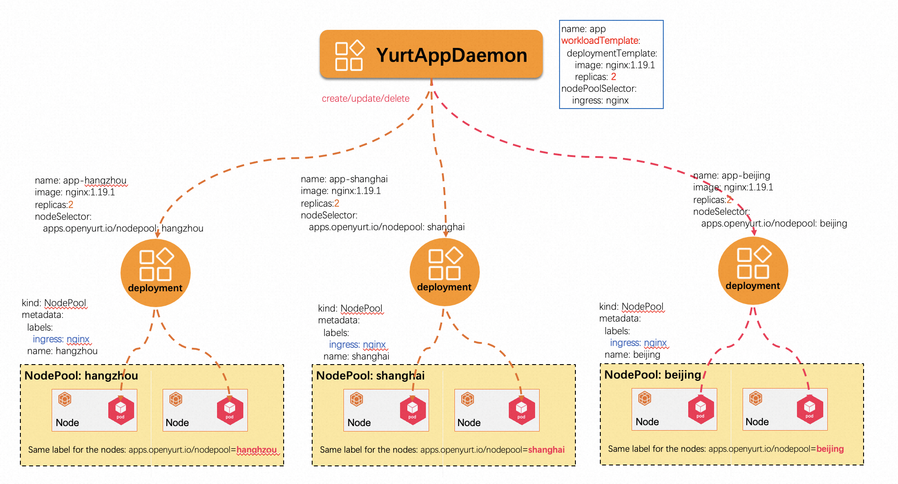

## 1.Introduction

The Yurt-Manager component consists of several controllers and webhooks, which are used to provide abilities to ensure that Kubernetes can work as it would in a normal data center
in a cloud-edge collaboration scenario. such as easily managing multi-regions workloads and providing AdvancedRollingUpdate and OTA upgrade capabilities for edge workloads(DaemonSet and static pods).

The Yurt-Manager component is recommended to co-located with Kubernetes control plane components such as Kube-Controller-Manager. and Yurt-Manager is deployed as a `Deployment`, usually consists of
two instances, one leader and one backup.

Each controller and webhook is described as follows.

### 1.1 `csrapprover` controller

Due to the stringent approval policy for CSR(Certificate Signing Request) in Kubernetes, 
the CSRs generated by OpenYurt components, such as YurtHub, are not automatically approved by theKube-Controller-Manager.
As a result, A controller named `csrapprover` within Yurt-Manager is responsible for approving the CSRs of OpenYurt components.

### 1.2 `daemonpodupdater` controller

The traditional RollingUpdate strategy for DaemonSet can become easily obstructed when NotReady nodes are present in a Cloud-Edge collaboration scenario. To address this issue, the `daemonpodupdater` controller employs two upgrade models: AdvancedRollingUpdate and OTA (Over-the-Air) upgrade.
The AdvancedRollingUpdate strategy initially upgrades pods on Ready nodes while skipping NotReady nodes. When a node transitions from NotReady to Ready, the daemon pod on that node is automatically upgraded.
The OTA strategy is utilized in scenarios where the decision to upgrade a workload falls under the purview of the edge node owner, rather than the cluster owner. This approach is particularly relevant in cases such as electric vehicles, where the edge node owner has greater control over the upgrade process.

### 1.3 `delegatelease` controller

The `delegatelease` controller is designed to work in conjunction with pool-coordinator component. When a node becomes disconnected from the cloud, the lease reported through
pool-coordinator component will have the `openyurt.io/delegate-heartbeat=true` annotation. Upon detecting a lease with this annotation, the `delegatelease` controller will apply the
`openyurt.io/unschedulable` taint to the node, ensuing that newly created pods cannot be scheduled on such nodes.

### 1.4  `podbinding` controller

Certain edge services require that Pods not be evicted in the event of node failure; instead, they demand a specific Pod to be bound to a particular node.
For instance, image processing applications need to be bound to the machine connected to a camera, while intelligent transportation applications must be fixed to a machine located at a specific intersection.
Users can add the `apps.openyurt.io/binding=true` annotation to nodes to enable the Pods Binding feature, ensuring that all Pods on that node are bound to it and remain unaffected by the cloud-edge network.

The podbinding controller oversees the management of pod tolerations when the `apps.openyurt.io/binding` annotation of a node is modified. If the `apps.openyurt.io/binding` node annotation is set to true,
the TolerationSeconds for `node.kubernetes.io/not-ready` and `node.kubernetes.io/unreachable` tolerations in pods will be set to 0, preventing the eviction of pods even when the cloud-edge network is offline.
Conversely, if the annotation is not set to true, the TolerationSeconds for `node.kubernetes.io/not-ready` and `node.kubernetes.io/unreachable` tolerations in pods will be set to 300 seconds.

### 1.5 `ravenl3` controller

The `ravenl3` controller serves as the controller for the Gateway Custom Resource Definition (CRD). This controller is intended to be used in conjunction with the Raven Agent component,
which facilitates Level3 network connectivity among pods located in different physical or network regions.

### 1.6 `nodepool` controller/webhook

NodePool abstracts the concept of a node pool based on specific node attributes, such as region, CPU architecture, cloud provider, and more, allowing for unified management of nodes at the pool level.

We are accustomed to grouping and managing nodes using various Kubernetes Labels. However, as the number of nodes and labels increases, the operation and maintenance of nodes (e.g., batch configuration of scheduling policies, taints, etc.) become increasingly complex, as illustrated in the following figure:

The `nodepool controller/webhook can` manage nodes across different edge regions from the perspective of a node pool, as depicted in the subsequent figure:

### 1.7 `poolcoordinatorcert` controller

The `poolcoordinatorcert` controller is responsible for preparing certificates and kubeconfig file for the pool-coordinator component. All certificates and kubeconfig files are stored as Secret resources within the system.

### 1.8 `servicetopology` controller

The servicetopology controller is used to assist [servicetopology filter](../user-manuals/resource-access-control/resource-access-control.md) in YurtHub to provide service topology routing capabilities for the cluster.
When topology annotation of service is modified, the servicetopology controller updates the corresponding endpoints and EndpointSlices, triggering a service topology update on the node side.

### 1.9 `yurtstaticset` controller/webhook

Owing to the vast number and distributed nature of edge devices, manually deploying and upgrading Static pods in cloud-edge collaboration scenarios can result in substantial operational challenges and increased risk of errors.
To address this issue, OpenYurt has introduced a new Custom Resource Definition (CRD) called YurtStaticSet to improve the management of Static pods. The yurtstaticset controller/webhook offers features such as AdvancedRollingUpdate and Over-The-Air (OTA) upgrade capabilities for static pods.

### 1.10 `yurtappset` controller/webhook

In native Kubernetes, managing the same type of applications across multiple nodepools requires creating a Deployment for each node pool, leading to higher management costs and potential risks of errors. To address this issue, the YurtAppSet CRD provides a way to define an application template (supporting both Deployment and StatefulSet) and is responsible for managing workloads across multiple nodepools.

YurtAppSet requires users to explicitly specify the node pools to which the workloads should be deployed by configuring its `Spec.Topology` field. This approach simplifies the application deployment and management process, making it easier to scale, upgrade, and maintain applications in a multiple nodepools environment. By using YurtAppSet, users can centrally manage application deployments across multiple nodepools, thereby reducing management complexity and potential risks of errors.

### 1.11 `yurtappdaemon` controller/webhook

In native Kubernetes, DaemonSet is used to run a daemon Pod on each node. When a node is added or removed, the corresponding daemon Pod on that node is automatically created or removed. However, when workloads need to be adjusted automatically based on the creation and removal of nodepools, DaemonSet cannot meet our needs.

YurtAppDaemon aims to ensure that workloads specified in the template (Spec.WorkloadTemplate) are automatically deployed in all nodepools or those selected by `Spec.NodePoolSelector`. When a nodepool is added or removed from the cluster, the YurtAppDaemon controller and Webhook create or remove workloads for the corresponding nodepool, ensuring that the required nodepools always contain the expected Pods.

